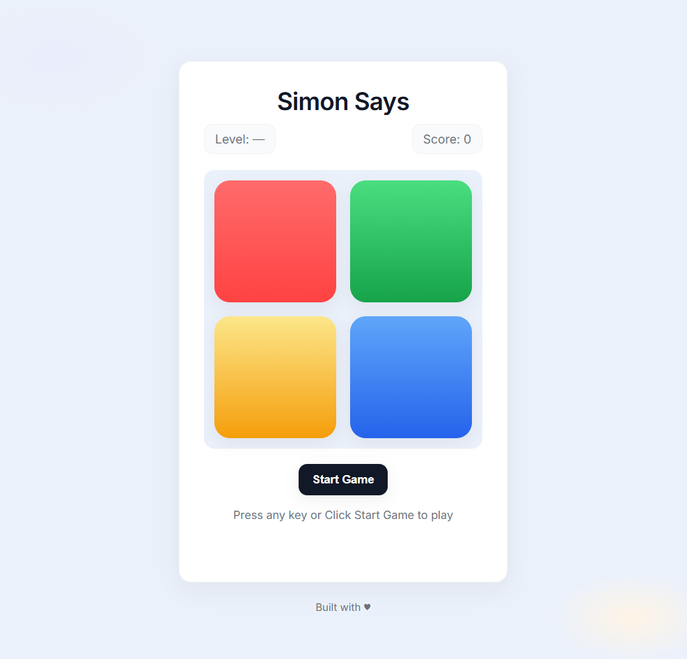

<h1 align="center">🎮 Simon Says  Game</h1>

  <i>A clean, minimal, and responsive Simon Says memory challenge built with pure HTML, CSS, and JavaScript.</i> 
  Test your memory as the sequence grows — simple visuals, smooth gameplay, and a modern look.

  
  
  
  

---
## 🌐 Live Demo

🚀 The project is deployed and live on **Netlify**! 

  🎯 <a href="https://simon-says-1-6.netlify.app/" target="_blank"><b>▶️ Play Live Demo</b></a>

## 🌟 Overview

A modern web-based **Simon Says Memory Game** where you:
- 🔹 Watch the sequence of flashing colors  
- 🔹 Repeat it in the same order to advance levels  
- 🔹 Challenge your focus and memory with every round  

No frameworks, no dependencies — just pure **HTML, CSS, and JavaScript** with a smooth, responsive UI.

---

## 🎨 Screenshots

| 🧩 Gameplay |
|:-------------:|
|  |

---

## 🚀 Features

✅ **Start Anytime** – press any key or click “Start Game”  
✅ **Dynamic Levels** – each round adds a new random color  
✅ **Instant Feedback** – flashing buttons and messages for each move  
✅ **Score Tracking** – shows your current level and total score  
✅ **Responsive UI** – clean, centered layout that fits any screen  
✅ **Restart Option** – restart instantly after a mistake  

---

## 🛠️ Tech Stack

| Technology | Purpose |
|-------------|----------|
| **HTML5** | Game structure and layout |
| **CSS3** | Styling, animations, and responsive design |
| **JavaScript (ES6)** | Game logic, sequence handling, and interactivity |
| **Inter Font** | Clean and readable typography |

---

## 💡 How to Run

1. Clone or download this repository  
2. Open **index.html** in any modern browser  
3. Press **Start Game** or any key to begin  
4. Watch, memorize, and repeat the sequence!

---

  🧠 <i>“Simple. Clean. Addictive.”</i>  

